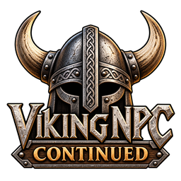

# VikingNPC Continued

<p align="center">
  
</p>

Community-maintained continuation of **VikingNPC (Norsemen)**,
originally created by **RustyMods**, updated for compatibility with
**Valheim 1.0**.

**Current version:** 0.4.1\
**Maintainer:** SephrinMods\
**Thunderstore:**
https://thunderstore.io/c/valheim/p/SephrinMods/VikingNPC_Continued/

> This continuation is published with permission from the original
> author. Credit for the original VikingNPC/Norsemen mod and its core
> systems belongs to RustyMods.

## About

VikingNPC adds friendly Viking/Norsemen NPCs to Valheim. Norsemen can be
tamed and equipped, assist the player, perform several tool-based
activities, and be configured through the mod's configuration and YAML
files.

VikingNPC Continued maintains the original mod while updating the source for
compatibility with Valheim 1.0. Existing technical identifiers have
intentionally been retained where possible to preserve compatibility
with existing configurations, prefab references, saves, and multiplayer
synchronization.

## Features

-   Tameable Viking/Norsemen NPCs
-   Configurable NPC spawning, base health, armor, equipment, and items
-   Randomized gear and inventory support
-   Equipped armor provides armor benefits
-   NPC inventories can be accessed
-   Tool-based activities: pickaxe mining, axe lumbering, and fishing
    with fishing rod and bait
-   Follow behavior and ship support
-   NPC revival through tombstones
-   Tamed creatures are ignored unless the Norseman is provoked
-   Happiness/food consumption behavior
-   Potion hotbar support
-   Equipped items are excluded from normal death drops

## Configuration

The continuation intentionally retains the original configuration
identity:

`RustyMods.Norsemen.cfg`

Additional configuration data is stored under the existing `Norsemen`
configuration directory.

### Random Gear Sets

Equipment can be configured through `Equipment.yml`.

``` yaml
Ashlands:
  Helmet:
    - HelmetFlametal
  Chest:
    - ArmorFlametalChest
  Legs:
    - ArmorFlametalLegs
```

### Random Items

``` yaml
Meadows:
  - CopperOre
```

## Prefab IDs

``` text
Meadows_Norseman_RS
BlackForest_Norseman_RS
Swamp_Norseman_RS
Mountains_Norseman_RS
Plains_Norseman_RS
Mistlands_Norseman_RS
Ashlands_Norseman_RS
```

## Console Commands

``` text
norsemen tame
norsemen clear_tombs
```

## Installation

Recommended installation is through Thunderstore/r2modman:

https://thunderstore.io/c/valheim/p/SephrinMods/VikingNPC_Continued/

Dependencies:

-   BepInExPack Valheim 5.4.2350
-   YamlDotNet 16.3.1

Do **not** install the original VikingNPC/Norsemen package and VikingNPC
Continued simultaneously.

## Building from Source

This repository contains the maintained C# source for VikingNPC
Continued. A local Valheim/BepInEx development environment is required
to resolve the game's assemblies and build the project.

Typical requirements include Visual Studio with C#/.NET support,
Valheim, BepInExPack for Valheim, the required Valheim/Unity assemblies,
and YamlDotNet.

Build outputs and Visual Studio-generated files are excluded from source
control through `.gitignore`.

## Compatibility

VikingNPC Continued retains important original identifiers:

-   Plugin GUID: `RustyMods.Norsemen`
-   Configuration file: `RustyMods.Norsemen.cfg`
-   Existing prefab IDs
-   Existing configuration directory
-   Existing synchronization/network identifiers
-   DLL name: `Norsemen.dll`

## VikingNPC Continued vs. LivingNorsemen

**VikingNPC Continued** is the compatibility-focused continuation of the
original VikingNPC/Norsemen mod.

**LivingNorsemen** is a separate extension project that expands the NPC
system with additional professions, behaviors, and gameplay systems.
Keeping them separate allows VikingNPC Continued to remain recognizable
and comparatively faithful to the original while LivingNorsemen can
evolve independently.

## Version 0.4.1

Bug-fix release addressing NPC persistence issues reported following the 0.4.0 release.

- Fixed equipped armor and weapon appearances not persisting correctly after NPCs unload and reload.
- Fixed resurrected Norsemen disappearing after leaving load distance.
- Fixed resurrected Norsemen disappearing after logging out and reloading the world.

## Version 0.4.0

-   Valheim 1.0 compatibility updates
-   Updates for changed Valheim APIs
-   Updated equipment and item handling
-   Updated NPC interaction and behavior where required
-   Centralized plugin version handling
-   Retained original compatibility identifiers
-   Updated maintainer/project metadata
-   Removed obsolete development/debugging code

## Credits and Permission

**Original mod:** VikingNPC / Norsemen\
**Original author:** RustyMods\
**Continuation maintainer:** SephrinMods

VikingNPC Continued is based on the original work by RustyMods and is
maintained and published with the original author's permission.

## License

No new license has been applied to this repository at this time. The
continuation is published with permission from the original author.
Licensing of the original source should not be assumed beyond the
permissions granted by its original author.
